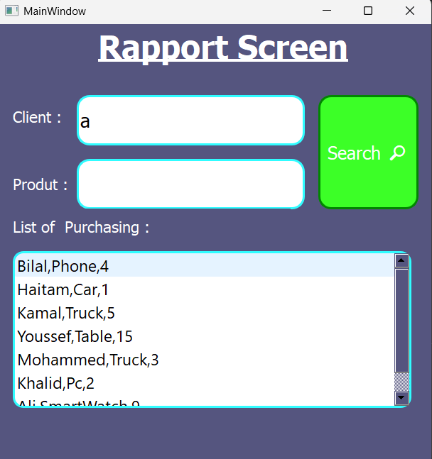

# Rapport Management App

## Overview

The **Rapport Management App** is a Python-based project that helps users manage and search through a list of purchasing data efficiently. This application features an intuitive interface built using PyQt5 and Qt Designer. The project was developed as part of my first-year school curriculum, showcasing foundational skills in Python programming and GUI development.

## Features

- **Search Functionality**: Search for items in a list stored in `ListofPurchasing.txt` and display matching results.
- **User Input Validation**: Displays warning messages if input fields are empty.
- **Interactive Interface**: Clear and responsive UI with error handling and visual feedback.

## Technologies Used

- **Python**: Core programming language.
- **PyQt5**: Framework for designing and implementing graphical user interfaces.
- **Qt Designer**: Tool used for creating UI components.

## Screenshots




## File Structure

```
E:\python\rapport_app\
│
├── Rapport_1.py         # Main script with app functionality
├── Rapport.py           # Generated UI script
├── Rapport.ui           # UI design file
├── ListofPurchasing.txt # File containing purchasing data
├── README.md            # Project documentation
└── assets               # Folder for storing images and other assets
```

## Installation and Usage

1. Clone or download the project repository to your local machine.
2. Ensure Python and PyQt5 are installed on your system.
3. Navigate to the project directory and install the required dependencies:

   ```bash
   pip install pyqt5
   ```

4. Run the application:

   ```bash
   python Rapport_1.py
   ```

## Notes

- Ensure that the `ListofPurchasing.txt` file exists in the project directory and contains relevant data for the search functionality.
- This project was developed as part of my first-year school curriculum and serves as an example of fundamental programming and UI development skills.

## Future Enhancements

- Adding support for editing and deleting items from the purchasing list.
- Implementing a database for better data management.
- Improving the UI with advanced styling and features.
